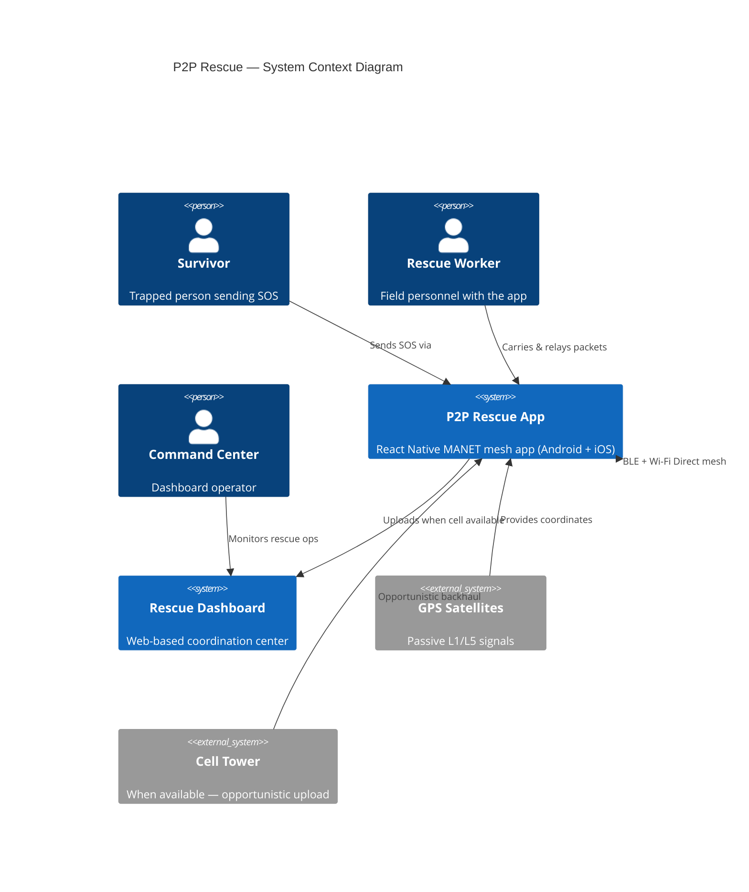
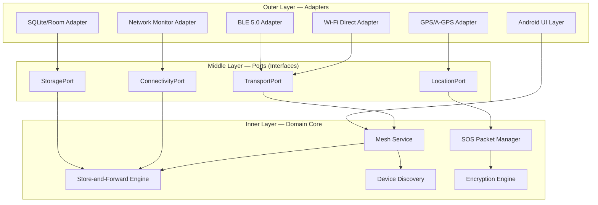
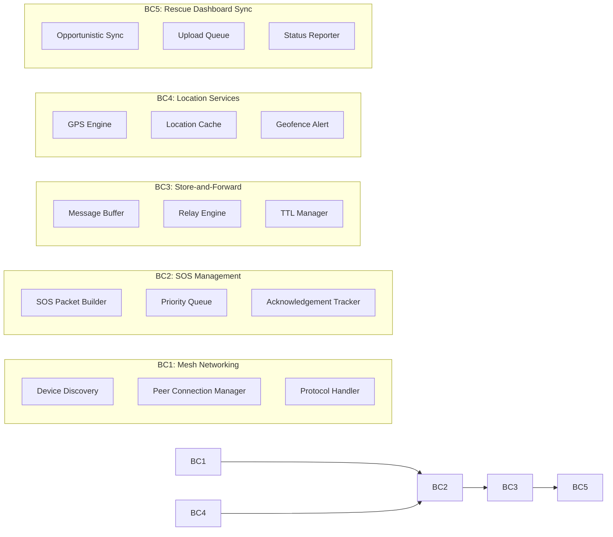
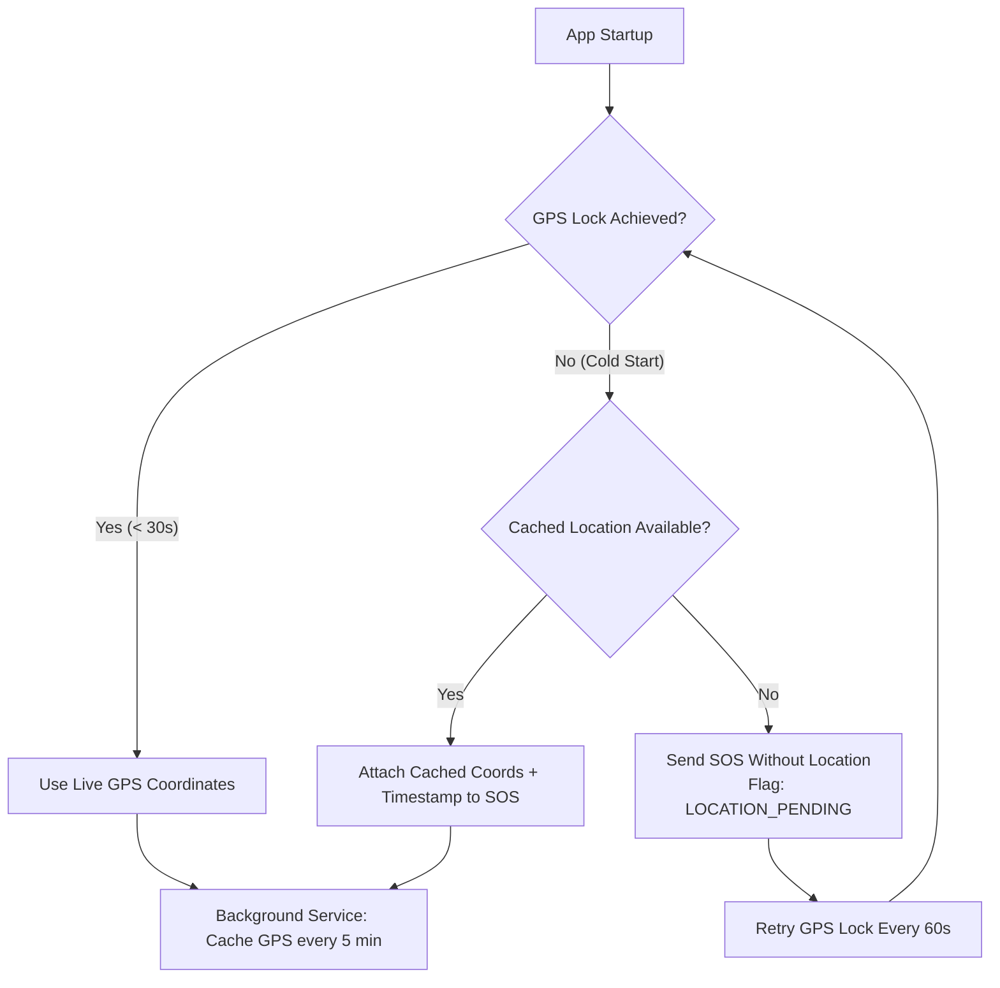
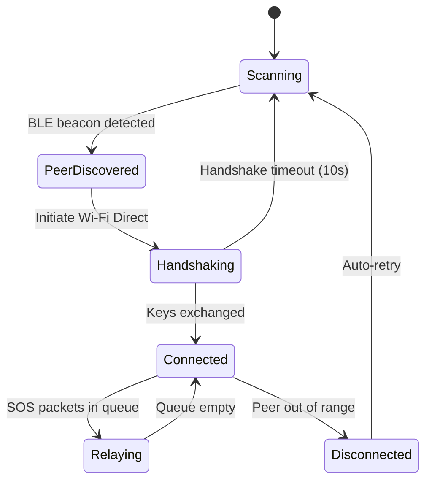
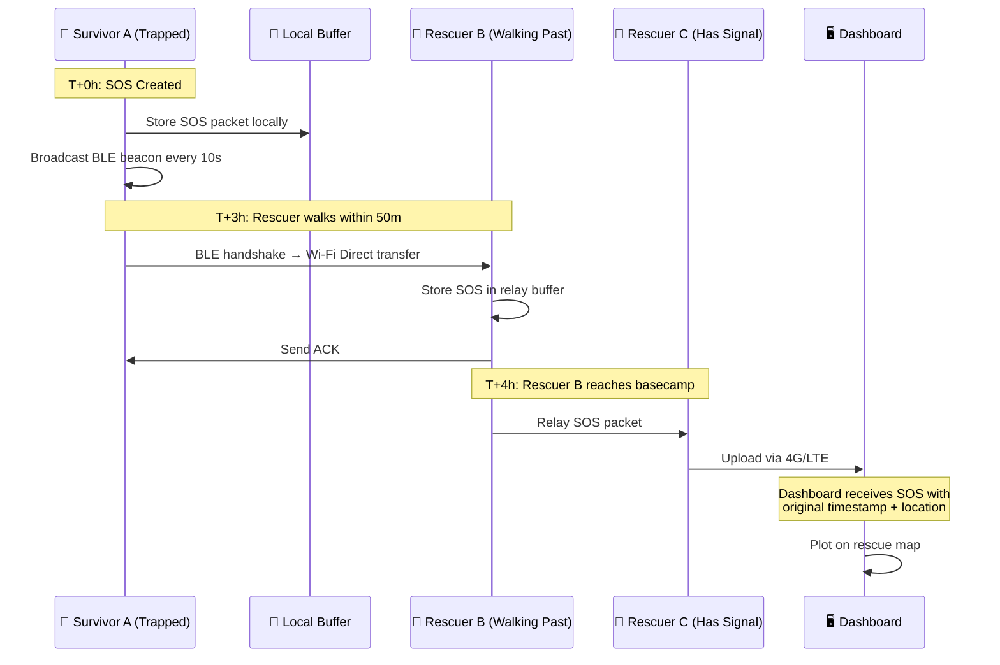
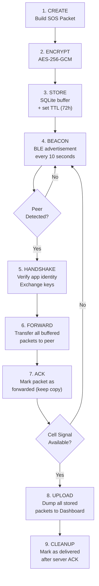
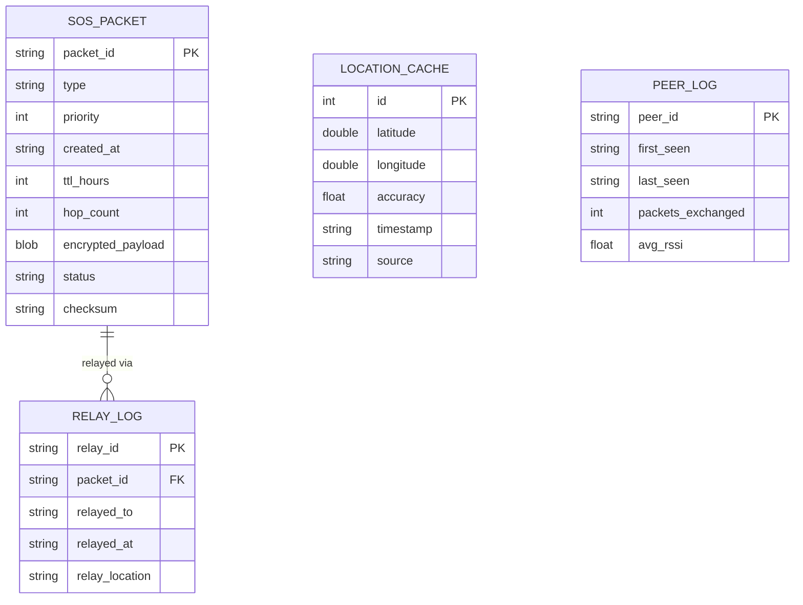
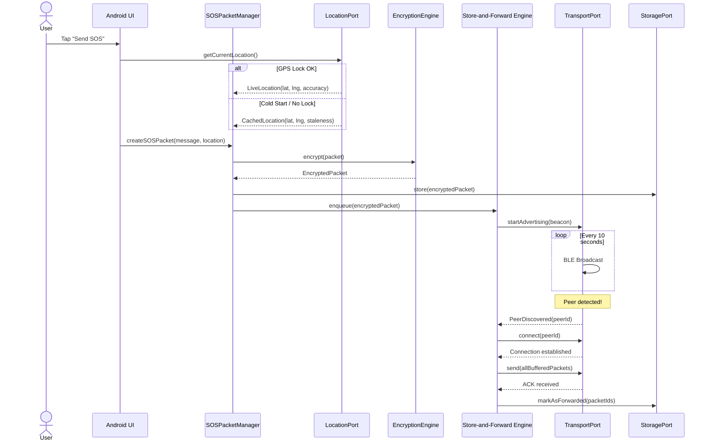
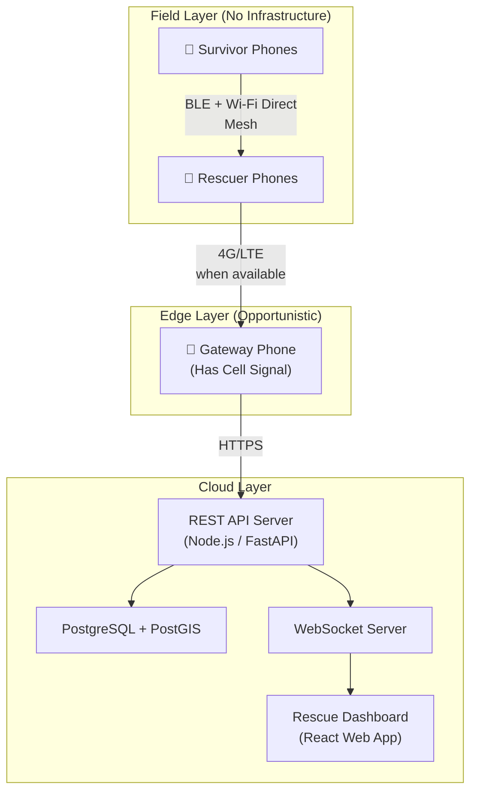

# P2P Rescue — Architecture Blueprint

> **Version:** 1.1  
> **Generated:** 2026-03-07 | **Updated:** 2026-03-07  
> **Architecture Pattern:** Event-Driven + Hexagonal + Delay-Tolerant Networking (DTN)  
> **Project Type:** Mobile Ad Hoc Network (MANET) — Cross-Platform (Android + iOS)  
> **Stack:** React Native + Bridgefy SDK + Foreground Service

---

## 1. Architectural Overview

P2P Rescue is a **disaster-resilient peer-to-peer communication system** that enables civilians and rescue workers to send SOS signals, share GPS coordinates, and relay critical data **without any cellular network or internet infrastructure**.

### Guiding Principles

| Principle                | Rationale                                                                      |
| ------------------------ | ------------------------------------------------------------------------------ |
| **Offline-First**        | Disasters destroy cell towers. Every feature must work with zero connectivity. |
| **Store-and-Forward**    | Messages travel physically in people's pockets via Delay-Tolerant Networking.  |
| **Multi-Protocol Mesh**  | BLE + Wi-Fi Direct ensures maximum range and device compatibility.             |
| **Privacy by Default**   | All packets are end-to-end encrypted; no personally identifiable data leaks.   |
| **Battery-Conserving**   | Survivors' phones are their lifeline. Every milliamp counts.                   |
| **Graceful Degradation** | The system adapts to zero peers, sparse peers, or dense peer networks.         |

### High-Level System Context



---

## 2. Core Architectural Layers

The system follows **Hexagonal Architecture (Ports & Adapters)** where the domain core is completely independent of the transport layer (BLE, Wi-Fi Direct) and can be tested without hardware.



### Layer Rules (Dependency Direction: Inward Only)

| Layer           | Knows About                         | Never Knows About                  |
| --------------- | ----------------------------------- | ---------------------------------- |
| **Domain Core** | Domain entities, ports (interfaces) | Android, BLE APIs, SQLite, GPS SDK |
| **Ports**       | Domain entities only                | Adapter implementations            |
| **Adapters**    | Ports + external SDKs               | Other adapters directly            |
| **UI**          | Ports (via DI)                      | Adapter internals                  |

---

## 3. Bounded Contexts (Domain-Driven Design)



---

## 4. GPS Without Network — Location Services Architecture

### The Misconception

GPS does **not** require cellular data. The GPS chip is a **passive radio receiver** that listens to satellite signals in Medium Earth Orbit.

### The Problem: Cold Start Latency

| Mode                        | Mechanism                                         | Time to First Fix |
| --------------------------- | ------------------------------------------------- | ----------------- |
| **Hot Start**               | Ephemeris cached, recent position known           | ~1 second         |
| **Warm Start**              | Almanac available, ephemeris expired              | ~30 seconds       |
| **Cold Start (No Network)** | Must download ephemeris from satellites at 50 bps | **2–12 minutes**  |

### Solution: Cached Location Strategy



### Implementation Pattern

```
LocationPort (Interface)
├── getCurrentLocation(): LocationResult
├── getCachedLocation(): CachedLocation?
├── startPeriodicCaching(intervalMs: Long)
└── getTimeSinceLastFix(): Duration

GPSAdapter (Implementation)
├── Uses: android.location.LocationManager
├── Caches to: Room DB (LocationCacheEntity)
├── Background: WorkManager periodic task
└── Fallback: Last known from LocationManager
```

**Key Design Decision:** The cached GPS coordinate is always attached with a `staleness_seconds` field. The Rescue Dashboard displays a confidence radius based on how old the fix is — a 5-minute-old fix might show a 500m radius; a 2-hour-old fix shows a 5km radius.

---

## 5. Multi-Protocol Mesh — Transport Architecture

### Protocol Stack

The app uses **two simultaneous radio protocols** to maximize range and compatibility.

| Protocol         | Range (Open Field) | Range (Through Rubble) | Power Draw | Use Case                           |
| ---------------- | ------------------ | ---------------------- | ---------- | ---------------------------------- |
| **BLE 5.0**      | ~200m              | **40–50m**             | Very Low   | Always-on beacon; device discovery |
| **Wi-Fi Direct** | ~250m              | **100–150m**           | Moderate   | Bulk data transfer; SOS relay      |

### Multi-Hop Mesh Topology


**Total effective range:** Theoretically **infinite** as long as the chain is unbroken.

### Transport Port & Adapters

```
TransportPort (Interface)
├── startAdvertising(packet: SOSPacket)
├── startScanning(): Flow<DiscoveredPeer>
├── connect(peer: PeerId): Connection
├── send(connection: Connection, data: ByteArray)
├── onReceive(): Flow<IncomingPacket>
└── getActiveConnections(): List<Connection>

BLETransportAdapter
├── Uses: Android BLE API (BluetoothLeAdvertiser, BluetoothLeScanner)
├── Beacon interval: 10 seconds (battery optimization)
├── Payload: Compact 31-byte BLE advertisement
└── Role: Discovery + lightweight SOS broadcast

WiFiDirectTransportAdapter
├── Uses: Android WifiP2pManager + Nearby Connections API
├── Payload: Full JSON SOS packet (up to 256KB)
├── Role: Bulk transfer, relay, acknowledgements
└── Fallback: Becomes access point if no peers found
```

### Connection State Machine



---

## 6. Store-and-Forward Engine (Delay-Tolerant Networking)

This is the **most critical architectural component**. It solves the **Sparse Network Problem** — what happens when no peers are in range.

### The Problem

Traditional mesh networking requires a continuous chain of connected nodes. In a disaster, survivors may be isolated with no one within radio range for hours.

### The Solution: DTN (Delay-Tolerant Networking)

Data travels **physically in the pockets of moving people**.



### Store-and-Forward Data Flow



### SOS Packet Schema (Domain Entity)

```json
{
  "packet_id": "uuid-v4",
  "version": 1,
  "type": "SOS",
  "priority": "CRITICAL",
  "created_at": "2026-03-07T12:00:00Z",
  "ttl_hours": 72,
  "hop_count": 0,
  "max_hops": 15,
  "sender": {
    "device_id": "sha256-hash-of-device",
    "app_instance": "anonymous-uuid"
  },
  "location": {
    "latitude": 28.6139,
    "longitude": 77.209,
    "accuracy_meters": 10,
    "fix_timestamp": "2026-03-07T11:55:00Z",
    "staleness_seconds": 300,
    "source": "GPS_LIVE | GPS_CACHED | NONE"
  },
  "payload": {
    "message": "Trapped under rubble, 3 survivors",
    "injured_count": 1,
    "water_available": false,
    "battery_percent": 34
  },
  "relay_chain": [
    {
      "device_id": "hash-of-relay-device",
      "relayed_at": "2026-03-07T15:00:00Z",
      "relay_location": { "lat": 28.62, "lng": 77.21 }
    }
  ],
  "encryption": {
    "algorithm": "AES-256-GCM",
    "key_exchange": "ECDH-P256"
  },
  "checksum": "sha256-of-packet"
}
```

---

## 7. Data Architecture

### Local Storage Model (Room / SQLite)



### Data Retention Policy

| Data Type             | Retention              | Reason                   |
| --------------------- | ---------------------- | ------------------------ |
| SOS Packets (own)     | Until server ACK + 24h | Ensure delivery          |
| SOS Packets (relayed) | 72 hours (TTL)         | Carry-and-forward window |
| Location Cache        | Rolling 24 hours       | Cold-start fallback      |
| Peer Logs             | 7 days                 | Network analysis         |

---

## 8. Cross-Cutting Concerns

### Security & Encryption

| Layer                 | Mechanism                     | Purpose                                |
| --------------------- | ----------------------------- | -------------------------------------- |
| **Packet Encryption** | AES-256-GCM                   | End-to-end SOS payload confidentiality |
| **Key Exchange**      | ECDH P-256                    | Ephemeral keys per peer connection     |
| **Device Identity**   | SHA-256 hash of hardware ID   | Pseudonymous, non-reversible           |
| **Relay Integrity**   | SHA-256 checksum per packet   | Tamper detection                       |
| **Anti-Replay**       | Packet ID + timestamp + nonce | Prevent duplicate injection            |

### Battery Conservation Strategy

| Strategy                   | Implementation                                             | Savings                         |
| -------------------------- | ---------------------------------------------------------- | ------------------------------- |
| **BLE Duty Cycling**       | Advertise 100ms every 10s                                  | ~90% BLE power reduction        |
| **Wi-Fi Direct On-Demand** | Only activate when BLE detects a peer                      | Avoids idle Wi-Fi drain         |
| **Adaptive Beacon Rate**   | Increase interval when battery < 20%                       | Extends device life by ~4 hours |
| **Batch Uploads**          | Buffer packets, upload in single burst when cell available | Avoids repeated radio wake-ups  |
| **Dark Mode Enforcement**  | OLED-optimized dark UI                                     | Up to 30% display savings       |

### Error Handling & Resilience

```
Error Hierarchy:
├── TransportError
│   ├── BLEUnavailableError → Fallback to Wi-Fi Direct only
│   ├── WiFiDirectError → Fallback to BLE only
│   └── AllTransportsDown → Pure store mode (wait for peer)
├── GPSError
│   ├── ColdStartTimeout → Use cached location
│   └── NoLocationEver → Send SOS with LOCATION_PENDING flag
├── StorageError
│   ├── DatabaseFull → Evict oldest relayed packets (keep own SOS)
│   └── CorruptedPacket → Discard + log
└── SyncError
    ├── ServerUnreachable → Re-queue for next opportunity
    └── AuthError → Retry with fresh token
```

---

## 9. Component Interaction — Full SOS Flow



---

## 10. Deployment Architecture



### Environment Configuration

| Environment            | Purpose                              | Mesh Protocol              | Backend                 |
| ---------------------- | ------------------------------------ | -------------------------- | ----------------------- |
| **Development**        | Emulator + 2 physical devices        | Mock transport (in-memory) | Local Docker            |
| **Staging**            | 5+ physical devices, indoor building | Real BLE + Wi-Fi Direct    | Cloud staging           |
| **Production (Field)** | Thousands of devices, disaster zone  | Real BLE + Wi-Fi Direct    | Geo-distributed backend |

---

## 11. Testing Architecture

| Test Type             | Scope                             | Tools                                | What It Validates                             |
| --------------------- | --------------------------------- | ------------------------------------ | --------------------------------------------- |
| **Unit Tests**        | Domain core (entities, use cases) | JUnit 5, MockK                       | Business logic, packet validation, TTL expiry |
| **Integration Tests** | Port ↔ Adapter wiring             | Robolectric, Room in-memory          | Database operations, GPS adapter              |
| **Protocol Tests**    | BLE/Wi-Fi handshake simulation    | Android Emulator + mock peers        | Connection state machine, packet transfer     |
| **DTN Simulation**    | Store-and-forward with delays     | Custom simulator (Kotlin coroutines) | Message delivery under sparse conditions      |
| **End-to-End**        | Full SOS → Dashboard flow         | 3+ physical devices + backend        | Real-world mesh relay                         |
| **Battery Profiling** | Power consumption benchmarks      | Android Profiler, Battery Historian  | BLE duty cycle, idle drain rate               |

---

## 12. Architectural Decision Records

### ADR-001: Hexagonal Architecture Over Layered

- **Context:** The app must work with multiple transport protocols (BLE, Wi-Fi Direct) that may change.
- **Decision:** Use Hexagonal Architecture with Ports and Adapters.
- **Rationale:** Transport protocols can be swapped without touching domain logic. Mock adapters enable testing without physical devices.
- **Consequence:** Slightly more boilerplate, but massive testability and flexibility gains.

### ADR-002: Store-and-Forward Over Live Mesh Only

- **Context:** In real disasters, continuous peer chains are unreliable.
- **Decision:** Implement Delay-Tolerant Networking with Store-and-Forward.
- **Rationale:** Messages survive network partitions; data "hitchhikes" on moving people.
- **Consequence:** Messages may arrive hours late, but they **arrive**. Timestamps must be attached at creation, not delivery.

### ADR-003: Dual-Protocol (BLE + Wi-Fi Direct) Over Single Protocol

- **Context:** BLE has low power but short range; Wi-Fi Direct has better range but higher power.
- **Decision:** Use both simultaneously — BLE for discovery/beaconing, Wi-Fi Direct for bulk transfer.
- **Rationale:** Maximizes effective range (40–150m through rubble) while conserving battery.
- **Consequence:** Increased complexity in connection management; requires protocol coordinator.

### ADR-004: Cached GPS Over GPS-Only

- **Context:** Cold-start GPS without A-GPS takes 2–12 minutes.
- **Decision:** Cache GPS coordinates every 5 minutes via background service.
- **Rationale:** In an emergency, waiting 12 minutes for GPS is unacceptable. A 5-minute-old cached fix is better than no location.
- **Consequence:** Cached coordinates may be stale; we attach `staleness_seconds` so the dashboard can display confidence radius.

### ADR-005: Anonymous Device Identity

- **Context:** Users need to send SOS without creating accounts or sharing personal data.
- **Decision:** Use SHA-256 hash of hardware ID as pseudonymous device identifier.
- **Rationale:** Privacy by default; no PII in mesh traffic. Hash is non-reversible.
- **Consequence:** Cannot identify specific individuals from packets alone — emergency responders rely on location and message content.

### ADR-006: React Native Over Native Kotlin

- **Context:** Building for Android-only limits reach; hackathon judges expect cross-platform.
- **Decision:** Use React Native with native modules for hardware access.
- **Rationale:** Single codebase for Android + iOS. Bridgefy SDK provides native bridge. UI iteration is faster.
- **Consequence:** Slightly more complexity in bridging native BLE/GPS; Bridgefy SDK handles the heavy lifting.

### ADR-007: Bridgefy SDK Over Custom BLE/Wi-Fi Mesh

- **Context:** Building raw BLE mesh networking from scratch requires months of work.
- **Decision:** Use Bridgefy SDK for all mesh networking and store-and-forward.
- **Rationale:** Battle-tested in real disasters (Mexico earthquake, Hong Kong). Handles BLE + Wi-Fi mesh, multi-hop relay, and DTN automatically. React Native bridge available.
- **Consequence:** Dependency on third-party SDK; free tier sufficient for hackathon; production would need licensing.

### ADR-008: Foreground Service for Background Survival

- **Context:** Android Doze Mode and OEM battery optimizations kill background apps.
- **Decision:** Use Android Foreground Service with persistent notification + request battery optimization exemption.
- **Rationale:** Only reliable way to keep BLE mesh alive when screen is off. Google Play permits this for safety/emergency apps.
- **Consequence:** Persistent notification visible to user ("P2P Rescue is active"); users must grant battery exemption.

---

## 13. Extension & Evolution Patterns

### Adding a New Transport Protocol (e.g., LoRa)

1. Create `LoRaTransportAdapter` implementing `TransportPort`
2. Register in the DI container alongside BLE and Wi-Fi Direct adapters
3. The `ProtocolCoordinator` automatically discovers and uses the new adapter
4. **Zero changes** to domain core, SOS management, or Store-and-Forward engine

### Adding New Packet Types (e.g., Resource Request)

1. Define new entity under `domain/entities/` (e.g., `ResourceRequest`)
2. Create corresponding use case under `use_cases/`
3. Extend the packet schema with a new `type` field value
4. Store-and-Forward engine relays it like any other packet — **no relay logic changes**

### Scaling to Emergency Broadcast (One-to-Many)

1. Current: Unicast peer-to-peer relay
2. Future: Add `BroadcastMode` to `TransportPort` — flood-fill with hop-count TTL
3. Anti-spam: Rate-limit broadcasts per device; priority queue for CRITICAL packets

---

## 14. Common Pitfalls to Avoid

| Pitfall                         | Why It Breaks Things                           | Prevention                                            |
| ------------------------------- | ---------------------------------------------- | ----------------------------------------------------- |
| **Assuming GPS needs internet** | App freezes waiting for network-based location | Implement cold-start + cache fallback                 |
| **Relying on continuous mesh**  | Isolated survivors never get help              | Store-and-Forward is non-negotiable                   |
| **Ignoring battery**            | Dead phone = dead lifeline                     | BLE duty cycling + adaptive beacon rate               |
| **Unbounded relay**             | Packet storms in dense networks                | Hop count limit (15) + TTL (72h) + dedup by packet_id |
| **Trusting relay integrity**    | Corrupted packets waste bandwidth              | SHA-256 checksum on every packet                      |
| **Fat UI layer**                | Business logic in Activities/Fragments         | Hexagonal: UI is a thin adapter                       |
| **Blocking main thread**        | ANR on SOS send                                | All mesh ops on coroutine dispatchers                 |

---

## 15. Project Directory Blueprint

```
P2PRescue/
├── src/                                     # React Native App
│   ├── domain/                              # Inner Layer — Pure JS/TS
│   │   ├── entities/
│   │   │   ├── SOSPacket.js
│   │   │   ├── Peer.js
│   │   │   ├── Location.js
│   │   │   └── RelayRecord.js
│   │   ├── valueobjects/
│   │   │   ├── DeviceId.js
│   │   │   ├── PacketId.js
│   │   │   └── GeoCoordinate.js
│   │   ├── ports/
│   │   │   ├── TransportPort.js
│   │   │   ├── LocationPort.js
│   │   │   ├── StoragePort.js
│   │   │   └── ConnectivityPort.js
│   │   └── events/
│   │       ├── SOSCreatedEvent.js
│   │       ├── PeerDiscoveredEvent.js
│   │       └── PacketRelayedEvent.js
│   ├── usecases/                            # Application Business Rules
│   │   ├── CreateSOSUseCase.js
│   │   ├── RelayPacketUseCase.js
│   │   ├── SyncToDashboardUseCase.js
│   │   └── CacheLocationUseCase.js
│   ├── adapters/                            # Outer Layer — Platform-specific
│   │   ├── transport/
│   │   │   └── BridgefyTransportAdapter.js   # Wraps Bridgefy SDK
│   │   ├── location/
│   │   │   └── GPSLocationAdapter.js         # react-native-geolocation
│   │   ├── storage/
│   │   │   └── AsyncStorageAdapter.js        # @react-native-async-storage
│   │   ├── network/
│   │   │   └── NetInfoConnectivityAdapter.js # @react-native-community/netinfo
│   │   └── encryption/
│   │       └── CryptoAdapter.js             # react-native-crypto-js
│   ├── services/                            # Background Services
│   │   ├── MeshForegroundService.js         # Android foreground service
│   │   ├── LocationCacheWorker.js           # Headless JS periodic task
│   │   └── SyncWorker.js                    # Opportunistic upload
│   ├── screens/                             # Presentation (Thin)
│   │   ├── SOSScreen.js
│   │   ├── NetworkStatusScreen.js
│   │   ├── MapScreen.js
│   │   └── OnboardingScreen.js
│   └── di/                                  # Dependency Wiring
│       └── container.js
├── android/                                 # Android native config
│   └── app/src/main/AndroidManifest.xml
├── ios/                                     # iOS native config
│   └── P2PRescue/Info.plist
├── __tests__/                               # Unit + Integration Tests
│   ├── domain/
│   ├── usecases/
│   └── adapters/
├── dashboard/                               # Web Dashboard (React)
│   ├── src/
│   │   ├── components/
│   │   ├── pages/
│   │   └── api/
│   └── package.json
├── server/                                  # Backend API
│   ├── src/
│   │   ├── routes/
│   │   ├── services/
│   │   └── database/
│   └── package.json
├── architecture.md                          # ← This document
├── task.md                                  # ← Project task breakdown
├── package.json
└── README.md
```

---

> **Blueprint generated:** 2026-03-07 | **Updated:** 2026-03-07  
> **Architecture:** Hexagonal + DTN + Event-Driven | **Stack:** React Native + Bridgefy SDK  
> **Recommendation:** Review this document before each development sprint. Update ADRs when making significant design changes.
